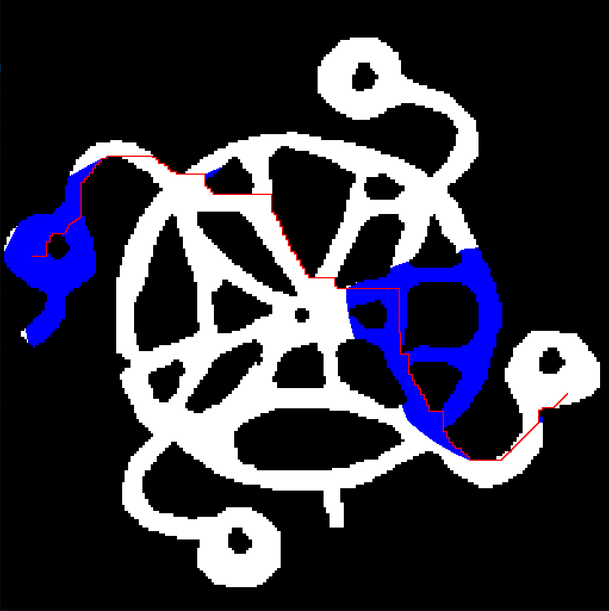
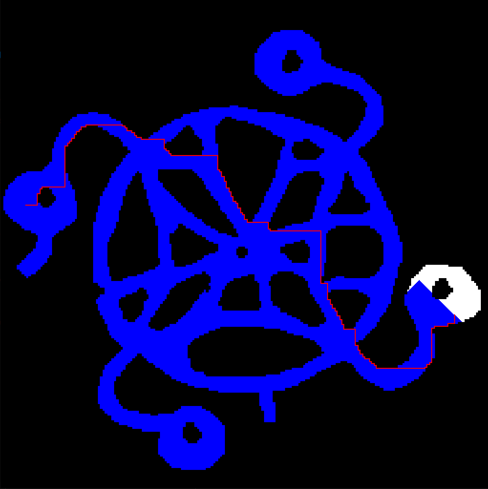
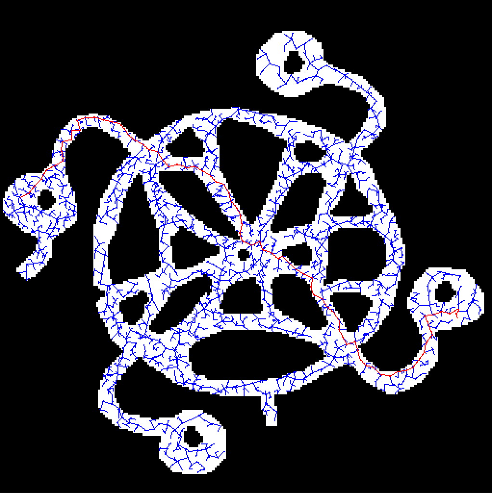
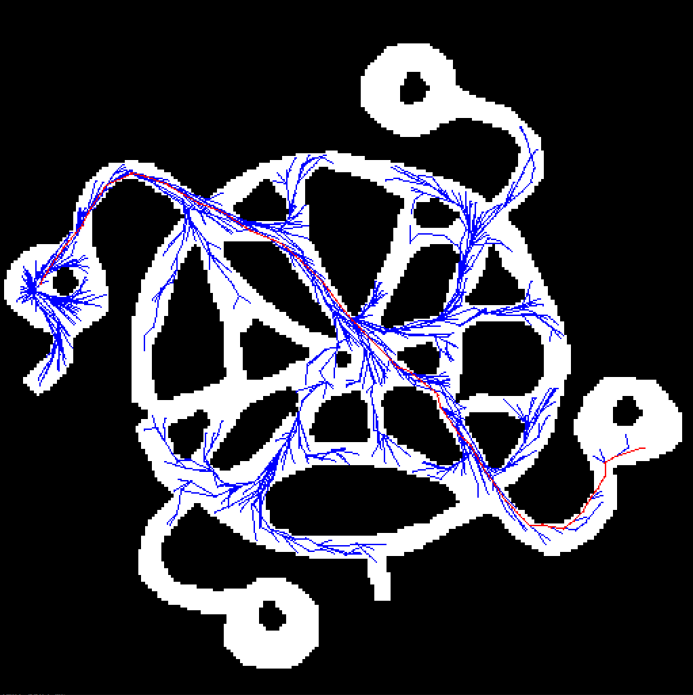

# 2D Pathfinding Algorithms

This project is consist of A*, Breadth-First Search, Depth-First Search, RRT (Rapidly exploring random tree) and RRT* algorithms.

## File Structure

```
path-planning/
├── CMakeLists.txt
├── config/
│   └── main.yaml
├── maps/..
├── planning/
│   ├── CmakeLists.txt
│   ├── grid_base
│   │   ├── CmakeLists.txt
│   │   ├── a_star/..
│   │   ├── bfs/..
│   │   └── dfs/..
│   └── tree_base
│   │   ├── CmakeLists.txt
│   │   ├── rrt/..
│   │   └── rrt_star/..
├── test/..
├── third-party/
│   └── yaml-cpp/..
├── tools/..

```

## Coloring

```
Free: White
Visited: Blue
Occupied: Black
Start: Green
Goal: Yellow
Path: Red
```

## Grid Based

### A Star



### BFS



## Tree Based

### RRT



### RRT Star




## Requirements

```
sudo apt-get install libsfml-dev
```
